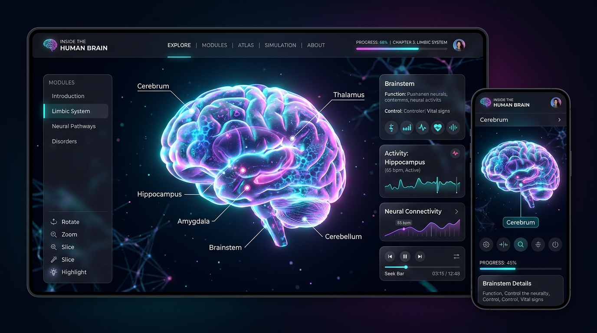

# Inside the Human Brain — 3D Interactive Atlas

A cinematic, scroll-driven 3D educational web atlas through the anatomical structures of the human brain, fully optimized for modern desktop, mobile phones, and tablets.

---

## 🧠 Website Preview



---

## ✨ Key Features

- **No VR Equipment Required**: Smoothly interactive in modern desktop and mobile browsers (Chrome, Safari, Firefox, Edge, Samsung Internet).
- **Scroll-Driven 3D Cinematography**: Scrolling seamlessly moves and rotates the camera deep inside the brain, revealing internal structures one by one.
- **10 Core Educational Sections**:
  1. **Introduction**: Complete 3D human brain slowly rotating in a dark futuristic atmosphere.
  2. **Cerebrum**: The cerebral cortex responsible for conscious thought, memory, emotions, and voluntary movement.
  3. **Corpus Callosum**: Camera penetrates into the center of the brain to reveal the dense axonal bridge connecting both hemispheres.
  4. **Thalamus**: Deep core diencephalon sensory relay and filtering switchboard.
  5. **Hypothalamus**: The master homeostatic regulator for temperature, hunger, thirst, sleep, and endocrine hormones.
  6. **Hippocampus**: Bilateral seahorse-shaped structures essential for memory consolidation and spatial mapping.
  7. **Amygdala**: Bilateral nuclei governing fear detection, threat response, and emotional processing.
  8. **Brainstem**: Downward descent showcasing the midbrain, pons, and medulla oblongata regulating vital automatic functions.
  9. **Cerebellum**: Posterior-inferior view of the "little brain" coordinating fine motor control, timing, and balance.
  10. **The Brain Works as One**: Zoom back out to reveal the complete brain with explored structures subtly illuminated in synchronized harmony + an **"Explore Again"** button.
- **Procedural 3D Anatomy**: Realistic procedural gyri, hemispheres, cerebellum folia, and internal tracts with zero external 3D asset dependencies.
- **Translucent Cortex / X-Ray Hologram**: Outer cerebral cortex smoothly transitions to a semi-transparent holographic shell when focusing on deep internal structures.
- **Interactive Click/Touch Inspection**: Click or tap any structure directly on screen or press "More Details" to open a comprehensive anatomical info card.

---

## 📱 Mobile & Tablet Features

- **Touch Controls**:
  - **Single-finger drag / swipe**: Freely rotate the 3D model horizontally.
  - **Two-finger pinch**: Zoom in and out smoothly.
  - **Direct tap**: Selects structures and updates the active inspection card.
- **Mobile Navigation Bar**: Fixed bottom bar with Previous (`‹`) / Next (`›`) step buttons and responsive section dots (44px+ touch targets).
- **Responsive Compact Cards**: Docked bottom cards formatted for comfortable one-handed mobile reading without obstructing the 3D brain model.
- **Orientation Awareness**: Dynamically adapts camera distance and FOV between portrait and landscape modes.
- **Performance Optimizations**:
  - Adaptive geometry tessellation on handheld devices.
  - DPR capping (`[1, 1.5]`) and low-power GPU profile.
  - Optimized lighting, reduced shadow maps, and lower particle counts on mobile.
- **Animated Loading & WebGL Fallback**:
  - Branded loading screen while procedural 3D shaders and geometries initialize.
  - Graceful WebGL error detection and user-friendly fallback screen.

---

## 🕹️ Controls & Navigation

| Action | Desktop | Mobile / Tablet |
| :--- | :--- | :--- |
| **Navigate Sections** | Mouse Wheel / Scroll | Vertical Scroll or Bottom Nav (`‹` / `›`) |
| **Rotate Model** | Click + Drag | 1-Finger Touch & Drag |
| **Zoom Model** | Section Scroll | 2-Finger Pinch In / Out |
| **Select Structure** | Click Structure / "More Details" | Tap Structure / "More Details" |
| **Restart Tour** | Click "Explore Again" | Tap "Explore Again" |

---

## 🧠 Medical & Anatomical Reference

| Structure | Anatomical Classification | Primary Physiological Role |
| :--- | :--- | :--- |
| **Cerebrum** | Telencephalon | Executive functioning, sensory synthesis, voluntary movement |
| **Corpus Callosum** | White Matter Commissure | Interhemispheric transfer (>200 million axons) |
| **Thalamus** | Diencephalon | Sensory routing & filtering (except olfaction) |
| **Hypothalamus** | Diencephalon / Endocrine | Autonomic homeostasis (temperature, hunger, sleep, hormones) |
| **Hippocampus** | Limbic System | Memory consolidation & spatial cognitive maps |
| **Amygdala** | Limbic System | Threat detection, fear conditioning, emotional memory |
| **Brainstem** | Truncus Encephali | Automatic vegetative life-support (respiration, cardiac rate) |
| **Cerebellum** | Metencephalon | Motor coordination, balance, procedural motor learning |

---

## 🛠️ Tech Stack

- **Framework**: [TanStack Start](https://tanstack.com/start) / React 19
- **3D Engine**: [React Three Fiber](https://r3f.docs.pmnd.rs) & [Three.js](https://threejs.org/)
- **Styling**: [Tailwind CSS v4](https://tailwindcss.com/)
- **Icons & UI Components**: Lucide React & Radix UI

---

## 🚀 Getting Started

### Prerequisites

- Node.js (v18+)
- npm or bun

### Installation

```bash
git clone https://github.com/humerakausargit/human-brain.git
cd human-brain
npm install
```

### Development Server

```bash
npm run dev
```

### Production Build

```bash
npm run build
npm run preview
```

---

## 📜 License

MIT
